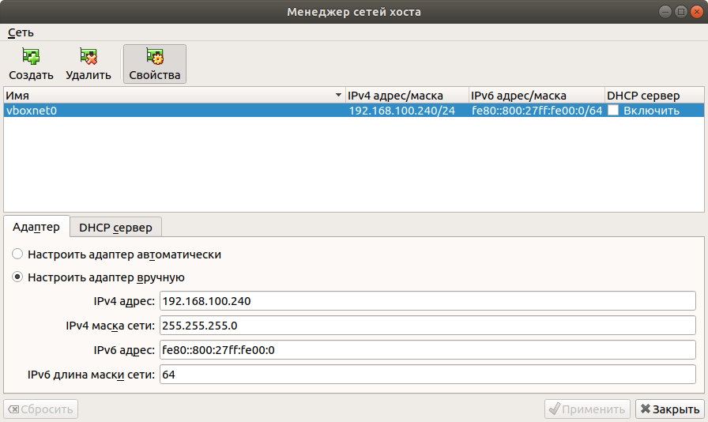
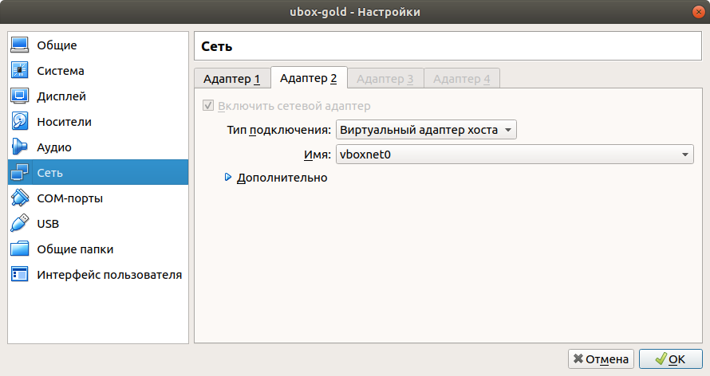
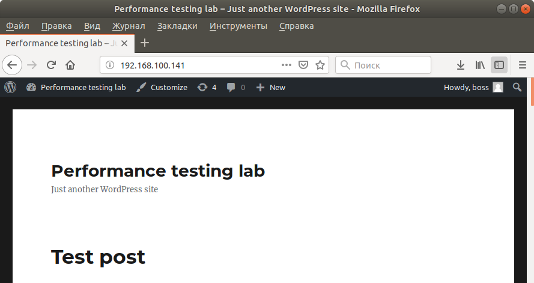

# [Подготовка тестового стенда к работе](/1_1_stand.md)

## Развертывание стенда

Скачать и установить Oracle Virtual Box:

* [https://www.virtualbox.org/wiki/Downloads](https://www.virtualbox.org/wiki/Downloads)

Скачать и открыть файл:

* http://training.ragozin.info/collateral/perflab.ova
* perflab.ova

Открыть окно:

* в Windows и в Linux:
    * окно "Менеджер сетей хоста": в главном меню **Файл** / **Менеджер сетей хоста ...** (или сочетание Ctrl + W)
    * окно "Host Network Manager": в главном меню **File** / **Host Network Manager ...** (или сочетание Ctrl + W)
* в MacOS:
    * открыть бовокое меню (значок списка) раздела **Tools** и выбрать раздел

Создать новый сетевой адаптер:

| Параметр                     | Значение        |
| ---------------------------- |:--------------- |
| (*) Настроить адаптер вручную|                 |
| IPv4 адрес                   | 192.168.100.240 |
| IPv4 маска сети              | 255.255.255.0   |

Создать ещё один сетевой адаптер:

| Параметр                     | Значение        |
| ---------------------------- |:--------------- |
| (*) Настроить адаптер вручную|                 |
| IPv4 адрес                   | 192.168.100.245 |
| IPv4 маска сети              | 255.255.255.0   |

## Проверка работоспособности

Перейти по адресу

 * [http://192.168.100.141/](http://192.168.100.145/)

Админка

 * [http://192.168.100.141/admin/](http://192.168.100.145/admin/) (boss@boss)

| Параметр| Значение|
| ------- |:------- |
| Логин   | boss    |
| Пароль  | boss    |

## Архитектура стенда

## Операционная система

## Приложения

## Процессор

## Память

## Файловая система

## Диски

## Сеть

## Проверка работоспособности

## Развертывание и проверка функционирования стенда

Веб-интерфейс WordPress 5.1.1:
* http://lab-wp.ragozin.info/
* https://lab-wp.ragozin.info/ - частичная работа сайта
* http://192.168.100.141

Панель администратора WordPress 5.1.1:
* http://lab-wp.ragozin.info/wp-admin/
    * логин: boss
    * пароль: boss
* http://192.168.100.141/wp-admin/

REST-API WordPress 5.1.1:
* http://lab-wp.ragozin.info/wp-json/wp/v2

Документация на REST-API WordPress:
* https://developer.wordpress.com/docs/api/

Консоль для отладки (для владельцев сайтом на wordpress.com):
* https://developer.wordpress.com/docs/api/console/

Grafana:
* http://192.168.100.144:3000/
    * логин: admin
    * пароль: admin

InfluxDB:
* http://192.168.100.144:8086/query