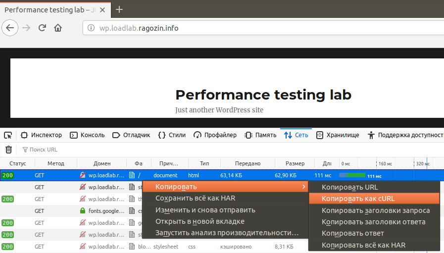

# Автоматизация отправки HTTP-запроса с curl

Простое задание:

1. Запустить браузер Mozilla
2. Открыть консоль разработчика F12, перейти на вкладку "Сеть"
1. Открыть страницу со стендом в браузере Mozilla: <http://wp.loadlab.ragozin.info>
3. Скопировать запрос на открытие главной страницы в виде curl-команды



Получится команда

`curl 'http://wp.loadlab.ragozin.info/' -H 'User-Agent: Mozilla/5.0 (X11; Ubuntu; Linux x86_64; rv:66.0) Gecko/20100101 Firefox/66.0' -H 'Accept: text/html,application/xhtml+xml,application/xml;q=0.9,*/*;q=0.8' -H 'Accept-Language: ru-RU,ru;q=0.8,en-US;q=0.5,en;q=0.3' --compressed -H 'Connection: keep-alive' -H 'Cookie: _ym_uid=1548859941871226753; _ym_d=1548859941; wp-settings-time-1=1557081907; wordpress_test_cookie=WP+Cookie+check' -H 'Upgrade-Insecure-Requests: 1'`


Части команды:

1. `curl` 
1. `'http://wp.loadlab.ragozin.info/'` 
1. `-H 'User-Agent: Mozilla/5.0 (X11; Ubuntu; Linux x86_64; rv:66.0) Gecko/20100101 Firefox/66.0'` 
1. `-H 'Accept: text/html,application/xhtml+xml,application/xml;q=0.9,*/*;q=0.8' `
1. `-H 'Accept-Language: ru-RU,ru;q=0.8,en-US;q=0.5,en;q=0.3' `
1. `--compressed `
1. `-H 'Connection: keep-alive'` 
1. `-H 'Cookie: _ym_uid=1548859941871226753; _ym_d=1548859941; wp-settings-time-1=1557081907; wordpress_test_cookie=WP+Cookie+check'` 
1. `-H 'Upgrade-Insecure-Requests: 1'`*


## Цикл с GET-запросом

```
#!/bin/bash

for i in {1..100}
do
curl \
    'http://wp.loadlab.ragozin.info/' \
    -H 'User-Agent: Mozilla/5.0 (X11; Ubuntu; Linux x86_64; rv:66.0) Gecko/20100101 Firefox/66.0' \
    -H 'Accept: text/html,application/xhtml+xml,application/xml;q=0.9,*/*;q=0.8' \
    -H 'Accept-Language: ru-RU,ru;q=0.8,en-US;q=0.5,en;q=0.3' \
    --compressed \
    -H 'Connection: keep-alive' \
    -H 'Cookie: _ym_uid=1548859941871226753; _ym_d=1548859941; wp-settings-time-1=1557081907; wordpress_test_cookie=WP+Cookie+check' \
    -H 'Upgrade-Insecure-Requests: 1'
done
```

## Цикл с POST-запросом

```
#!/bin/bash

for i in {1..10}
do
author="author_email=owasp@yandex.ru&author_name=owasp"
comment="content=$i. Current date `date`"

curl \
    http://wp.loadlab.ragozin.info/wp-json/wp/v2/comments \
    --user boss:boss \
    -d "post=1&$author&$comment&status=approve" \
    -X POST 
done
```

Теперь на странице 
<http://wp.loadlab.ragozin.info/2019/05/04/hello-world/>
добавилось 10 новых комментариев.